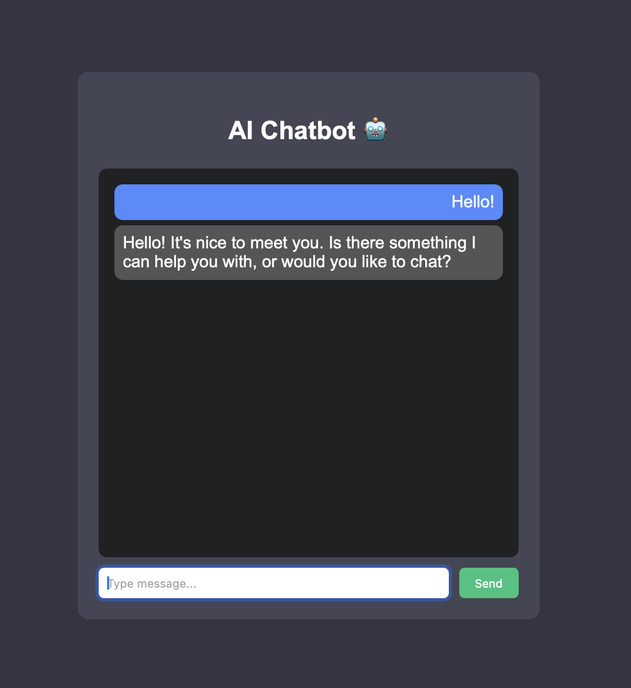

# AI Chatbot

A simple AI chatbot built using:

- HTML
- CSS
- JavaScript
- Node.js
- Ollama (Llama3 AI model)

## Features

- ChatGPT-style interface
- Real AI responses
- Local AI model
- Fast responses

## Run the project

1. Install dependencies

npm install

2. Run server

node server.js

3. Open

index.html
## Demo

